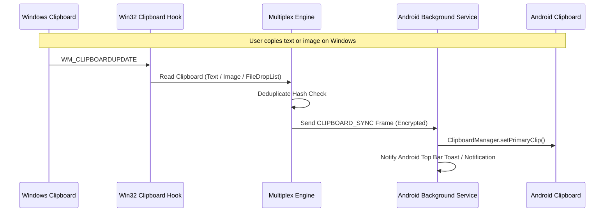

# System Architecture: ConnectToPhone

## 1. Architectural Philosophy

ConnectToPhone is engineered around five fundamental design rules:
1. **Zero Intermediate Servers**: All communication is direct, peer-to-peer (P2P), encrypted, and operates completely offline over physical and local interfaces (Wi-Fi, USB, Bluetooth).
2. **Channel-Agnostic Chunk Multiplexing**: The transfer engine does not care whether a byte moves over Wi-Fi, USB cable, or Bluetooth. Data is sliced into discrete, verified units (chunks) and dynamically scheduled across all active physical pipes.
3. **Single-Device Bidirectional Autonomy**: The user should never need to touch both devices simultaneously. A phone user can remotely browse and pull from PC drives; a PC user can remotely browse and pull from phone storage.
4. **Zero-Loss Resilience**: Any transport can connect or disconnect at any millisecond without disrupting an active session. Inflight chunks are re-routed; transfers pause gracefully and resume from the exact byte offset.
5. **High-Performance Native Implementation**:
   - **Android**: Pure Kotlin with Coroutines, non-blocking Java NIO channels, Jetpack Compose, and Android Foreground Service.
   - **Windows**: Pure C# .NET with `System.IO.Pipelines` (zero-copy memory pooling), memory-mapped files, Win32 Clipboard hooks, and WinRT Bluetooth.

---

## 2. Layered Architecture

```
+-----------------------------------------------------------------------------------+
|                            APPLICATION LAYER                                      |
|  [Android: Jetpack Compose UI]             [Windows: Fluent UI & System Tray]     |
|  - Transfer Progress & Speed Meters        - Taskbar Progress (TaskbarItemInfo)   |
|  - Remote PC File Browser                  - Remote Phone Explorer                |
|  - Quick Action Tiles                      - MCP AI Server (Stdio/SSE)            |
+-----------------------------------------------------------------------------------+
|                            SERVICE & SYNC LAYER                                   |
|  [Android Foreground Service]              [Windows Background Daemon]            |
|  - Ongoing Status Bar Notification         - Taskbar & Notification Toasts        |
|  - Clipboard Auto-Sync Service             - Clipboard Monitor (Win32 Hook)       |
|  - Remote Virtual File Provider (SAF)      - Virtual Storage Provider (Drives)    |
|  - Pluggable Extensions (Mirror/Remote)    - Pluggable Extensions Host            |
+-----------------------------------------------------------------------------------+
|                        CORE MULTIPLEX & CHUNK ENGINE                              |
|  - Dynamic Chunk Scheduler (Windowing & RTT Bandwidth Probing)                    |
|  - Multi-Path Bonding (Aggregating USB + Wi-Fi Bandwidth)                         |
|  - Reassembly Sparse File Writer (Random-Access Chunk Writes)                     |
|  - Cryptographic Chunk Hash Verifier (Blake3 / CRC32)                             |
|  - Resumption & Failover State Machine                                            |
+-----------------------------------------------------------------------------------+
|                        FRAMING & PROTOCOL ENCODER                                 |
|  - Magic Header (0xCAFE) + Session ID + Frame Type + Payload Length               |
|  - Binary Protocol Framing (Protobuf / Compact Binary Encoding)                   |
|  - Authenticated Encryption (ChaCha20-Poly1305 / AES-256-GCM via ECDH)            |
+-----------------------------------------------------------------------------------+
|                        TRANSPORT ADAPTER ABSTRACTION                              |
|   +-----------------------+   +-----------------------+   +--------------------+  |
|   |    Wi-Fi Transport    |   |     USB Transport     |   | Bluetooth Transport|  |
|   |  (LAN / Wi-Fi Direct) |   |  (AOA / ADB / RNDIS)  |   | (BLE + RFCOMM SPP) |  |
|   +-----------------------+   +-----------------------+   +--------------------+  |
+-----------------------------------------------------------------------------------+
```

---

## 3. Core Engine Subsystems

### 3.1 Multi-Path Bonding & Chunk Scheduler
Traditional file transfer tools bind a transfer to a single socket. If that socket drops, the transfer fails. If two interfaces exist, one sits completely idle.

ConnectToPhone introduces **Dynamic Multi-Path Chunk Bonding**:
1. **Manifest Exchange**: When a transfer begins, a `TRANSFER_METADATA` frame is exchanged containing:
   - File ID (`uint64`)
   - Relative Path & Name
   - Total File Size (`uint64`)
   - Chunk Size ($S$, default 2 MB)
   - Total Chunks ($N = \lceil \text{FileSize} / S \rceil$)
   - Root Merkle Tree or Global Hash
2. **Adaptive Window Scheduler**:
   - The sender maintains an active pipeline queue.
   - Each active transport (e.g. USB at 180 MB/s, Wi-Fi at 60 MB/s) is assigned chunks proportionally to its current measured throughput and round-trip acknowledgment latency ($RTT$).
   - A chunk is marked `IN_FLIGHT` on transport $T_i$.
   - When receiver confirms `TRANSFER_ACK(ChunkIndex)`, the chunk is marked `VERIFIED`.
3. **Instant Failover (Zero-Loss Resilience)**:
   - If transport $T_i$ drops (e.g., USB cable pulled out), any chunk currently marked `IN_FLIGHT` on $T_i$ without ACK is immediately returned to the unassigned queue and dispatched via the next available transport (Wi-Fi).
   - If all transports disconnect, the session enters `PAUSED_DISCONNECTED` state. The receiver keeps all verified written chunks on disk. Once any transport reconnects, the handshake resumes from the exact unverified chunks.
4. **Receiver Sparse File Writer**:
   - The receiver allocates file metadata immediately.
   - Chunks arrive out-of-order across bonded transports.
   - The receiver writes each chunk directly into its pre-calculated byte offset (`offset = ChunkIndex * ChunkSize`) using random-access non-blocking I/O (`FileChannel` on Android, `RandomAccessFile` / `MemoryMappedFile` on Windows).

---

## 4. Live Speed & System Notifications

### 4.1 Android Ongoing Top-Bar Speed Display
- Android manages long transfers using an `Android Foreground Service` with `FOREGROUND_SERVICE_TYPE_DATA_SYNC`.
- Notification features:
  - **Status Bar Summary**: Displays current instantaneous aggregate transfer speed (e.g., `⚡ 124.5 MB/s`).
  - **Active Transports Indicator**: Badges showing which pipes are contributing (e.g. `[USB 85 MB/s] + [Wi-Fi 39.5 MB/s]`).
  - **Dynamic Progress Bar**: Live progress percentage, remaining estimated time (ETA), and bytes transferred ($X$ GB / $Y$ GB).
  - **Direct Actions**:
    - **Pause / Resume** button.
    - **Cancel** button.
    - **Open Folder** on completion.

### 4.2 Windows Taskbar & System Tray Integration
- **Taskbar Progress**: Uses Windows `ITaskbarList3` / WPF `TaskbarItemInfo`:
  - Shows progress directly on the ConnectToPhone taskbar icon (Normal green bar during transfer, yellow paused, red on error).
- **System Tray Icon**:
  - Hovering tooltip displays: `ConnectToPhone: Connected (USB + Wi-Fi) | ⚡ 124 MB/s`.
  - Right-click menu for quick toggles: Auto Clipboard Sync, Open Remote Phone Explorer, Exit.
- **Windows Notification Center (Toasts)**:
  - Dispatched via Windows Toast Notification API when a transfer completes or remote clipboard is copied.

---

## 5. Bidirectional Remote Explorer ("Single-Device Control")

A cornerstone feature is that either device can act as the controller.

### 5.1 Remote PC Explorer (From Phone)
- The Windows desktop app runs a secure File System Host.
- The Phone displays a native file browser with root access to:
  - Common folders (Desktop, Downloads, Documents, Pictures, Videos).
  - Mounted drives (`C:\`, `D:\`, external drives).
- Actions available on Phone:
  - Tap folder to enter.
  - Long press file or multi-select $\rightarrow$ **Download to Phone**.
  - Tap **Upload to here** $\rightarrow$ select mobile photos/videos/documents to upload directly into the PC directory.

### 5.2 Remote Phone Explorer (From PC)
- The Android app exposes storage volumes via Android Storage Access Framework (SAF) and MediaStore.
- The Windows desktop app displays a Phone Explorer tab:
  - Fast media grid: Camera photos, screenshots, WhatsApp media, Downloads.
  - Internal Storage tree.
- Actions available on PC:
  - Drag and drop files from Windows Explorer straight into the Phone Explorer window.
  - Select files on Phone $\rightarrow$ **Download to PC**.

---

## 6. Real-Time Clipboard Synchronization



- **Loop Prevention**: Each clipboard payload includes a unique 64-bit hash. When a device receives and sets the remote clipboard, it records the hash in its local ignore-cache. When its own clipboard listener fires in response, it compares hashes and ignores the self-induced echo.
- **Supported Formats**: Plain text, HTML rich text, URIs, and compressed image thumbnails/blobs (PNG/WebP).

---

## 7. Model Context Protocol (MCP) Integration

The Windows desktop application hosts a native Model Context Protocol (MCP) server.

### Supported Tools:
1. `connect_get_devices`: Returns all discovered and paired devices, their connection types (USB, Wi-Fi, BT), battery level, and latency.
2. `phone_list_directory(path)`: Lists files and subdirectories on the connected phone.
3. `phone_download_file(phone_path, local_destination)`: Triggers a high-speed chunked pull from phone to local disk.
4. `phone_upload_file(local_path, phone_destination)`: Pushes a local file or folder to phone storage.
5. `phone_get_clipboard()`: Reads the phone's current clipboard.
6. `phone_set_clipboard(text)`: Pushes a string or link directly to the phone's clipboard.
7. `phone_show_notification(title, message)`: Pushes an alert notification to the phone screen.

---

## 8. Scalability & Future Extensions

The protocol is explicitly designed for modular future expansion through standardized frame categories:

```
Frame Type Ranges:
0x00 - 0x0F: Core Link & Handshake (Handshake, Keepalive, Disconnect)
0x10 - 0x1F: Clipboard & Text Sync
0x20 - 0x2F: Virtual File System & Remote Explorer
0x30 - 0x3F: High-Throughput Chunk Transfer & Verification
0x40 - 0x4F: Screen Mirroring & Display Extension (H.264 / AV1 Video NAL Units)
0x50 - 0x5F: Remote Utility Control (Mouse, Keyboard, Media, Power)
0x60 - 0x6F: Audio Streaming & Microphone Forwarding
```

See [MODULES_AND_EXTENSIONS.md](MODULES_AND_EXTENSIONS.md) for detailed specifications on Screen Mirroring, Virtual Display Extension, and PC Remote Control.
