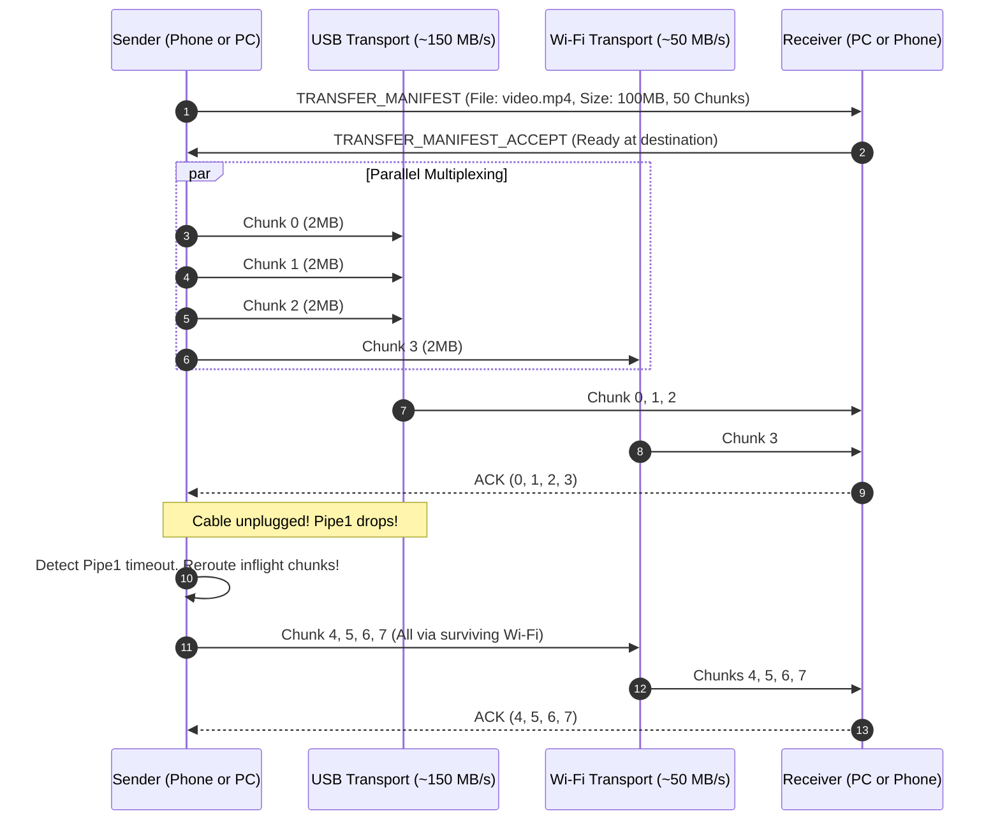

# Network Wire Protocol Specification

Version: **1.0.0**  
Transport Agnostic: Operates identically across TCP (Wi-Fi), USB Stream (AOA / ADB forward / RNDIS), and Bluetooth (RFCOMM / L2CAP).

---

## 1. Frame Layout & Serialization

Every message transmitted over any physical transport starts with a fixed 16-byte binary header followed by a variable-length payload:

```
 0                   1                   2                   3
 0 1 2 3 4 5 6 7 8 9 0 1 2 3 4 5 6 7 8 9 0 1 2 3 4 5 6 7 8 9 0 1
+-+-+-+-+-+-+-+-+-+-+-+-+-+-+-+-+-+-+-+-+-+-+-+-+-+-+-+-+-+-+-+-+
|       Magic (0xCAFE)          | Version (0x01)| Frame Type ID |
+-+-+-+-+-+-+-+-+-+-+-+-+-+-+-+-+-+-+-+-+-+-+-+-+-+-+-+-+-+-+-+-+
|                     Session ID (Bits 0-31)                    |
+-+-+-+-+-+-+-+-+-+-+-+-+-+-+-+-+-+-+-+-+-+-+-+-+-+-+-+-+-+-+-+-+
|                     Session ID (Bits 32-63)                   |
+-+-+-+-+-+-+-+-+-+-+-+-+-+-+-+-+-+-+-+-+-+-+-+-+-+-+-+-+-+-+-+-+
|                     Payload Length (uint32)                   |
+-+-+-+-+-+-+-+-+-+-+-+-+-+-+-+-+-+-+-+-+-+-+-+-+-+-+-+-+-+-+-+-+
|                                                               |
+                    Payload Data (N Bytes)                     +
|                                                               |
+-+-+-+-+-+-+-+-+-+-+-+-+-+-+-+-+-+-+-+-+-+-+-+-+-+-+-+-+-+-+-+-+
|                     CRC32 / Checksum (4B)                     |
+-+-+-+-+-+-+-+-+-+-+-+-+-+-+-+-+-+-+-+-+-+-+-+-+-+-+-+-+-+-+-+-+
```

### 1.1 Header Fields
| Field | Type | Size | Description |
|---|---|---|---|
| **Magic** | `uint16` | 2 Bytes | Fixed marker `0xCAFE` (big-endian) to confirm packet sync. |
| **Version** | `uint8` | 1 Byte | Protocol version (currently `0x01`). |
| **Frame Type** | `uint8` | 1 Byte | Numerical ID defining payload semantics (see §2). |
| **Session ID** | `uint64` | 8 Bytes | Random 64-bit session token generated during mutual handshake. |
| **Payload Length** | `uint32` | 4 Bytes | Length $N$ of Payload Data in bytes (0 to $16 \text{ MB}$). Little-endian. |
| **Payload Data** | `byte[]` | $N$ Bytes | Serialized payload according to Frame Type. |
| **Checksum** | `uint32` | 4 Bytes | CRC32-C (Castagnoli) checksum computed over Header + Payload. |

---

## 2. Frame Type Registry

### 2.1 Core Link & Handshake (`0x00` - `0x0F`)
- `0x01` **HANDSHAKE_SYN**:
  - `DeviceName` (UTF-8 string)
  - `DeviceType` (`0` = Windows, `1` = Android)
  - `SupportedTransports` (bitmask: `0x01` = Wi-Fi, `0x02` = USB, `0x04` = Bluetooth)
  - `PublicKey` (32 bytes X25519)
- `0x02` **HANDSHAKE_ACK**:
  - `Accepted` (boolean)
  - `SessionID` (uint64)
  - `PublicKey` (32 bytes X25519)
  - `PairingPIN` (6-digit numeric verification code for first-time trust)
- `0x03` **HEARTBEAT_PING**:
  - `TimestampMillis` (uint64)
- `0x04` **HEARTBEAT_PONG**:
  - `EchoTimestampMillis` (uint64)
  - `BatteryLevel` (uint8: 0-100)
  - `IsCharging` (boolean)
- `0x05` **DISCONNECT**:
  - `ReasonCode` (uint8)

### 2.2 Clipboard Synchronization (`0x10` - `0x1F`)
- `0x10` **CLIPBOARD_SYNC**:
  - `Format` (`0x01` = PlainText, `0x02` = HTML, `0x03` = ImageBlob, `0x04` = FileList)
  - `ContentHash` (uint64 deduplication hash)
  - `Timestamp` (uint64 epoch millis)
  - `Content` (UTF-8 string or binary WebP/PNG byte array)

### 2.3 Remote Virtual File System (`0x20` - `0x2F`)
- `0x20` **FS_LIST_DIR_REQ**:
  - `DirectoryPath` (UTF-8 string, e.g. `"C:\\Users\\Public"` or `"/storage/emulated/0/Download"`)
  - `IncludeHidden` (boolean)
- `0x21` **FS_LIST_DIR_RESP**:
  - `DirectoryPath` (UTF-8 string)
  - `EntriesCount` (uint32)
  - Array of entries:
    - `Name` (UTF-8)
    - `IsDirectory` (boolean)
    - `SizeBytes` (uint64)
    - `ModifiedTimestamp` (uint64)
    - `IconType` (uint8: folder, image, video, audio, archive, doc, generic)
- `0x22` **FS_PULL_FILE_REQ**:
  - `RemotePath` (UTF-8 string)
  - `StartOffset` (uint64, for resuming partially downloaded files)
- `0x23` **FS_PUSH_FILE_INIT**:
  - `TargetPath` (UTF-8 string)
  - `TotalSizeBytes` (uint64)
  - `FileName` (UTF-8 string)

### 2.4 High-Speed Transfer Engine (`0x30` - `0x3F`)
- `0x30` **TRANSFER_MANIFEST**:
  - `TransferID` (uint64)
  - `FileName` (UTF-8)
  - `TotalSize` (uint64)
  - `ChunkSize` (uint32, default: 2,097,152 bytes = 2 MB)
  - `TotalChunks` (uint32)
  - `WholeFileHash` (32 bytes Blake3 / SHA-256)
- `0x31` **TRANSFER_CHUNK**:
  - `TransferID` (uint64)
  - `ChunkIndex` (uint32, 0 to TotalChunks - 1)
  - `ChunkDataLength` (uint32)
  - `ChunkData` (binary payload, up to ChunkSize)
  - `ChunkHash` (8-byte truncated Blake3 / CRC64)
- `0x32` **TRANSFER_CHUNK_ACK**:
  - `TransferID` (uint64)
  - `ChunkIndex` (uint32)
  - `Status` (`0` = OK, `1` = Corrupted/Retry)
- `0x33` **TRANSFER_PAUSE**:
  - `TransferID` (uint64)
  - `Reason` (uint8)
- `0x34` **TRANSFER_RESUME**:
  - `TransferID` (uint64)
  - `ReceivedBitfield` (compact bitmask of already completed chunk indices)
- `0x35` **TRANSFER_COMPLETE**:
  - `TransferID` (uint64)
  - `FinalStatus` (uint8: `0` = Verified & Stored, `1` = Hash Mismatch)

---

## 3. Dynamic Multi-Path Bonding Engine



### 3.1 Sparse Random-Access Receiver
Because chunks are bonded across multi-speed links, they arrive out-of-order (e.g. Chunk 0, Chunk 3, Chunk 1, Chunk 2).
The receiver opens a pre-allocated file:
$$\text{FileOffset} = \text{ChunkIndex} \times \text{ChunkSize}$$
The receiver writes directly at $\text{FileOffset}$ without buffering in RAM. A bitset tracks completed chunks:
$$\text{Bitset}[\text{ChunkIndex}] = 1$$
When all bits from $0$ to $\text{TotalChunks}-1$ are $1$, the file is validated and finalized.
